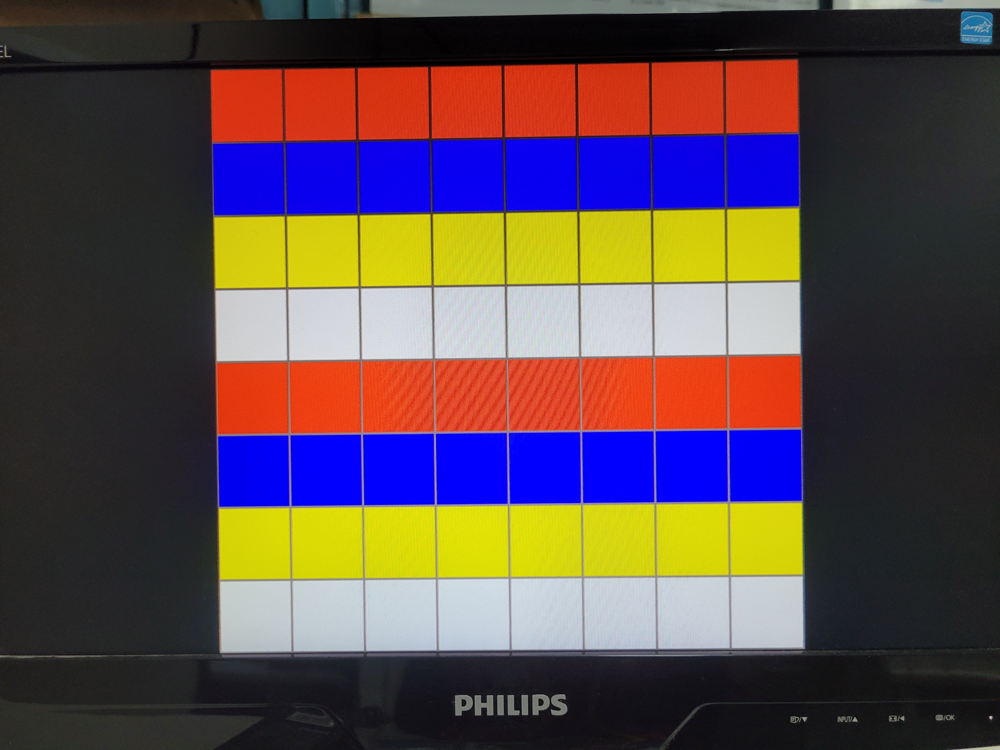
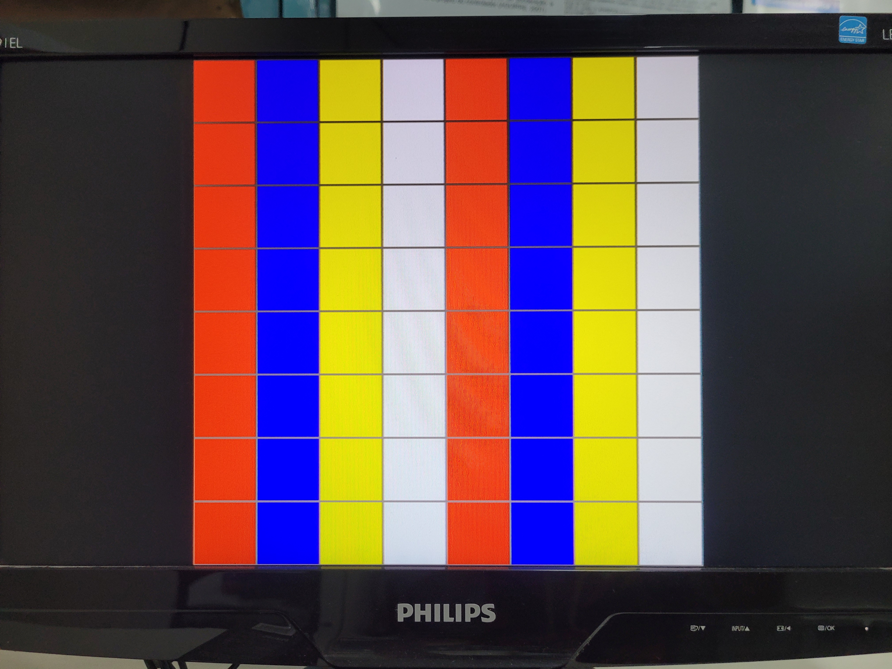
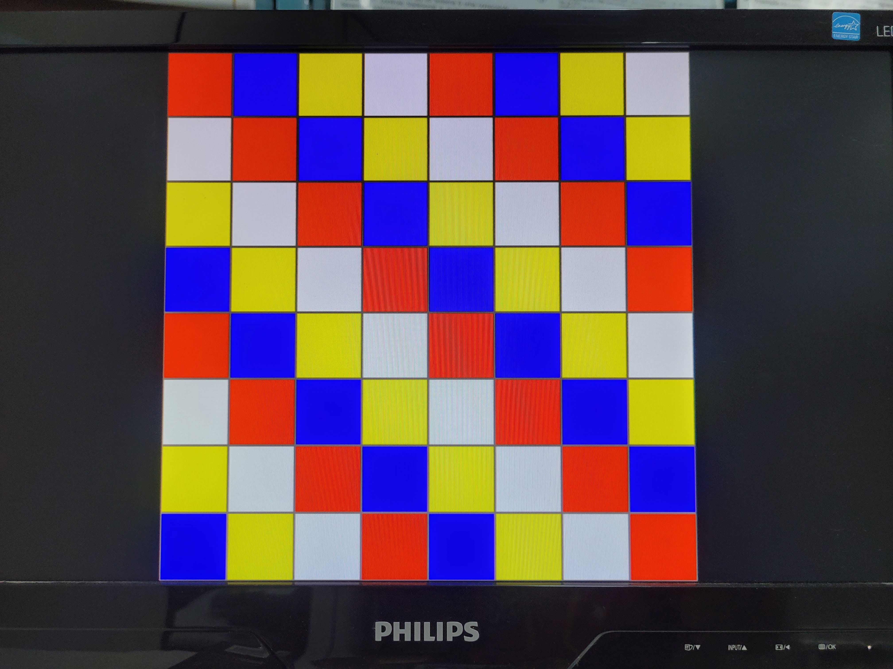
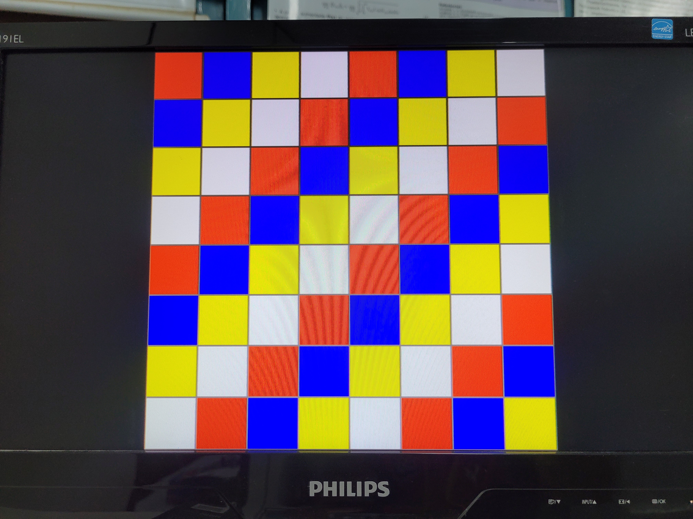

# VGA-grid-interface

## O que é isso?
É uma interface simples para utilizar um monitor VGA, sendo capaz de desenhar quadrados coloridos em posições previamente estabelecidas.




## Como funciona?
Existem 64 registradores, cada um para quadrado [58 x 58] no monitor. Para visualizar cada quadrado de forma individual há uma grade cinza dividindo cada um deles.

Em "address", os bits [2:0] são usados para identificar a coluna e os bits [5:3] são utilizados para identificar a linha que o programador pretende editar.

As cores possíveis são quatro:
*	00 - Vermelho
*	01 - Azul
*	10 - Amarelo
*	11 - Branco

Para obter essas cores é preciso enviar o valor correspondente na entrada "data".

Ao fim, para confirmar a escrita é necessário ativar o sinal "write_enable", para escrever os valores no registrador.


## Exemplo:
Para desenhar um quadrado azul na posicão [1][2], isso seria
nas colunas de 8 - 15 e linhas 16 - 23 basta fazer:

```text
col = 8/8 = 1;
lin = 16/8 = 2;
address = {{2},{1}} ou {3'b010,3'b001};

azul = 01;
data = 2'b01;

write_enable = 1'b1; (por 1 ciclo já basta).
```

## Como usar em meu projeto?
Copie os arquivos *VGA_driver.v* e *VGA_interface.v* para seu projeto e instancie o módulo VGA_interface.

```verilog
VGA_interface 
	u1(
		.clk_25mhz(), 
		.reset(), 
		.write_enable(),
		.data(),
		.address(),
		.v_sync(), 
		.h_sync(),
		.R(),
		.G(),
		.B()
	);
```
